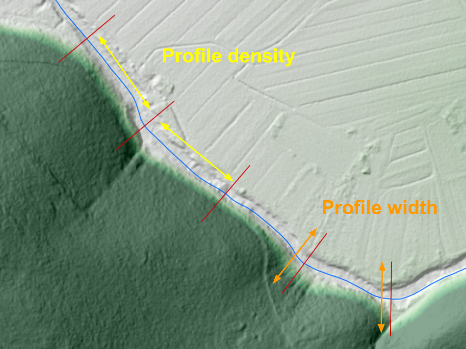

------------------------------
Cross section creation methods
------------------------------

While specifying the input parameters for cross sections in ``inputs.py``, user will be asked to choose the desired ``CREATION_METHOD``.
There are 3 different profile creation options (or methods) to choose from:

   - :ref:`AUTO<auto>`: automatic profile generation based on generic parameters and DEM values.

   - :ref:`LINES<lines>`: generation based on a line shapefile containting predefined cross sections and DEM values.

   - :ref:`MEASUREMENTS<measurements>`: parsing the shapefile, containing the geodetic surveying points - no DEM sampling.

Each creation method requires a different set of input parameters. Below we discuss each possible option:

.. _auto:

AUTO
----

This is the simplest available profile creation method, as it doesn't require any existing point measurements or
hand-drawn cross section lines as an input. Profile locations are generated automatically along the river lines according
to the specified creation parameters:

- A parameter ``PROFILE_DENSITY`` defines the distance between the autogenerated profiles. Defaults to 200 meters.

- A parameter ``PROFILE_WIDTH`` defines the desired width of a cross section profile. Profile will stretch half this distance on each
  side of the river center-line. Defaults to 100 meters.

All profiles are generated perpendicular to the river line, starting almost at the beggining of the river, ending almost
at the end of the river and with an evenly spaced linear distance from each other.

.. warning:: Mind that such a mindless cross section generation comes with a (besides poorly defined river geometry) a very probable breaking
             of the "only one river at one point" rule, especially with very dense placement on wide profiles on a very curvy river
             stream lines. All cross sections with ambiguous chainage definition get assigned a chainage 0.

   Parameters, required for a fully automatic profile generation

.. _lines:

LINES
-----

This creation option requires an existing Line shapefile which previously (possibly manually) generated cross section
locations. This option gives you more freedom and accuracy in catching the hydraulic situation of the terrain, compared
to "auto" cration method. You can use QGIS to carefully place every single cross section at the exact location that you
find important for the performance of your model, as well enables you to avoid cris-crossing of the profiles. Profile 
names will be automatically generated.

.. _measurements:

MEASUREMENTS
------------

This creation options a bit specific as it is the only one that doesn't include gathering elevation data from DEM.
It is actually more of a parser of the geodetic survey points, passed to a program in a form of a point shapefile
``XSECTION_SHP``. Therefore the shapefile requires quite a rigid structure to ensure points get parsed correctly.
Let's see the required parameters:

- ``XSECTION_PROFILE_ID_FIELD`` is a shapefile field, containing a name of the profile that certain point belongs to.

- ``SECTION_POINT_ID_FIELD`` is a shapefile field, contaning a consecutive number (order) of the certain point within a profile.

- ``Z_FIELD`` is a shapefile field, containg an evelation (height) value of the certain point.
