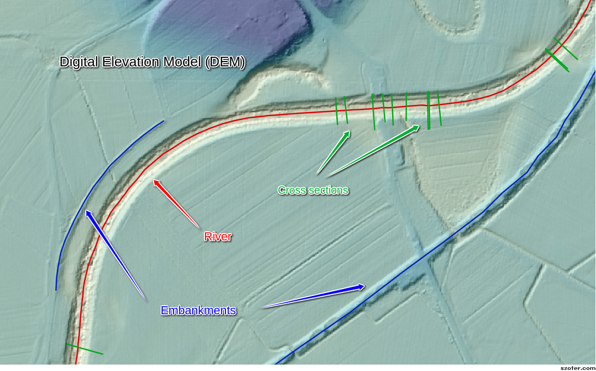
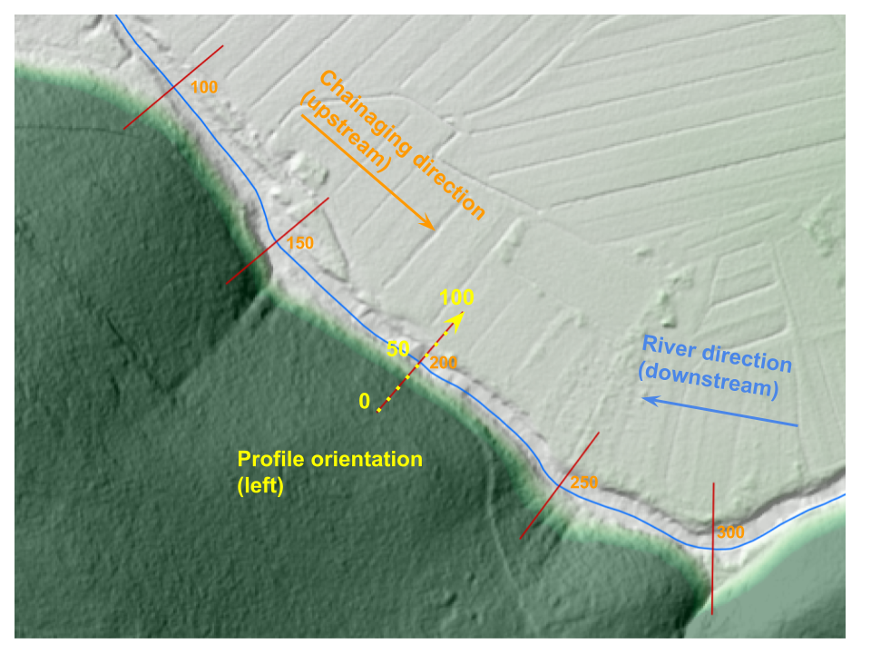

------------------------
Overview of key elements
------------------------

.. warning:: All the math inside Xsection works in a cartesian coordinate system. Neither does Xsection perform any
            reprojections or transformations of the input spatial data. Therefore is absolutely neccessary
            for user to make sure that all data inputs (shapefiles, rasters,...) are in the **identical projected coordinate system!**.
            Use QGIS or any other GIS tool to perform any reprojections of the input data with different spatial reference!

In order to clarify the key concepts and the terminology, used in this project, we will start with an overview of the key
elements. They are displayed on the picture below:

   All key input geometry elements in Xsection

.. note:: All the uppercase keywords highlighted like ``THIS`` are also input varibles parameters in program, so read carefully and
          make sure you understand their meaning and role!

Rivers
------

Rivers are imported into a program as a Line Shapefile. Program accepts only one river shapefile ``RIVER_SHP``,
where you can have many rivers as separate LineString features. Every river must have an unique name that is saved
in a shapefile column, called ``RIVERNAME_FIELD``. Rivers also have a very important hydraulic-modelling-specific property:
river orientation or ``CHAINAGING_DIRECTION``. This can be "upstream" or "downstream". If ``CHAINAGING_DIRECTION`` is chosen
to "upstream", this means that river "starts" at its lowest lying point and its chainage (or length) is increasing "upstream".
Of course, vice versa for the "downstream". This river property is important for linear referencing applications, especially
for chainaging river cross sections, and is a global setting, set for all rivers in a shapefile at once.

Digital Elevation Model (DEM)
-----------------------------

Digital evelation model (or ``DEM_FILE``) must be a **.tif** raster file, covering the whole extents of the river and desired cross
section locations. It is a mandatory input even if not direct point sampling is desired - it is neccessary for background
setting river orientation (i.e. flipping the order of river points to match the desired linear referencing order).

One important setting, indirectly connected with the input ``DEM_FILE`` resolution, is ``SAMPLING_DENSITY``.
This is a general project-wise setting that defines a distance between two consecutive points in any program-generated
point sampling operation. It defaults to 1m, however, if less detailed output profile/embankment/riverline is needed,
you can set this number to your liking.

Embankments
-----------

Embankments represents any linear longitudinal objects, normally along the river line, that you would like to have point
sampled from the DEM. As an input type, they are a similar data source as the ``RIVERS_SHP`` (ESRI Line shapefiles):
program onlye accepts one embankments file ``EMBANKMENTS_SHP``, it's attribute table must contain a field, called
``EMBANKMENTS_NAME_FIELD`` with unique embankments names. The only difference is that whole embankments thing is completely
optional.

Cross sections
--------------

Cross sections are the most important river geometry feature in 1D river modelling. Cross sections are lines that lie (normally)
perpendicular to the river stream line, where each line consists of many vertices, describing the shape of the river profile.
One important property of the general cross section setup is ``XSECTION_ORIENTATION``, which can only be "left" or "right".
This property specifies, how the points in cross section should be ordered. If "left", it means that the first point in
a cross section will lie on a "left" bank of the river, where "left" bank is defined as the bank that is on your left in
a river's downstream local coordinate system. Or put shortly: a left side of the profile is also left side of the river,
if one would look at the river from a boat going downstream.
Another important attributes of a cross section profiles are of course it's linear referencing attributes.

- a river that it belongs to
- a chainage at which it is placed onto.

They get set automatically as the program is run.

.. note:: Each cross section must have one (and only one!) crossing point with one (and only one!) river. That is the
         only way to ensure a proper profile attributes, such as river, chainaging and orientation.

   Example of river with "left" ``PROFILE_ORIENTATION`` and "upstream" ``CHAINAGING_DIRECTION``

