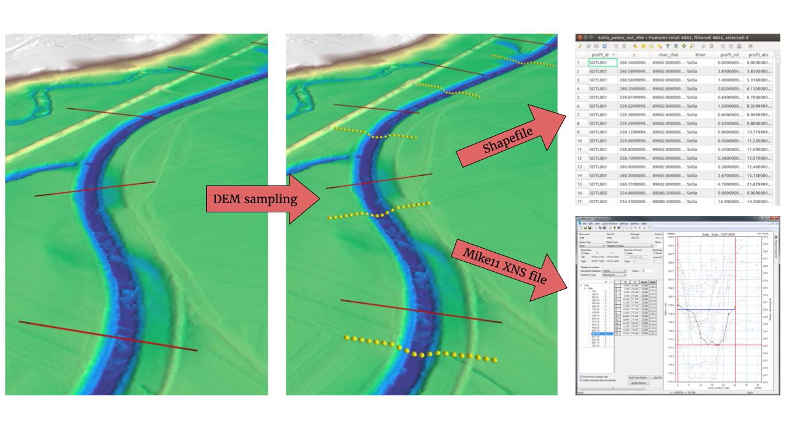

.. Xsection documentation master file, created by
   sphinx-quickstart on Tue Aug 22 15:55:01 2017.
   You can adapt this file completely to your liking, but it should at least
   contain the root `toctree` directive.

Welcome to Xsection documentation!
==================================

Xsection is a Python-written script for creating cross sectional river profiles, normally used in 1D hydraulic modelling.

   River cross section generation and chainaging made easy!

The program features:

- vertex sampling of 2D shapefiles to pick their elevation values from underyling Digital Elevation Models (DEM)
- parsing 3D terrestrial surveying 3D points into profiles
- automatic setting of river direction and cross section orientation (no need for careful manual creation anymore!)
- automatic calculation of the profile chainages according to the desired incrementation (upstream or downstream)
- conversion of the results into ASCII version of the *XNS11* geometry file from **Mike11 by** software.
- different profile creation options:

   1. auto-generated profiles (based on DEM and input parameters)
   2. profiles from 2D Line Shapefile and DEM
   3. profiles from a 3D geodetic suverying points in Shapefile

Program is heavily inspired by DHI's proprietary plugin, called Mike 11 GIS, and a QGIS plugin for HEC-RAS, RiverGIS.

.. note:: Xsection is only available as a command
          line script with a file-based input specification, so in order to properly modify and visualize
          input and output geospatial data, it is mandatory to work with a decent GIS software. I strongly suggest installing
          `QGIS`_ as it is a very intuitive open-source alternative to proprietary GIS tools.

.. _QGIS: http://www.qgis.org/en/site/forusers/download.html

The following documentation will get you through the installation process and program usage.

.. toctree::
   :maxdepth: 2
   :caption: Contents:

   installation
   elements
   creation-methods
   results
   running-xsection
   about

