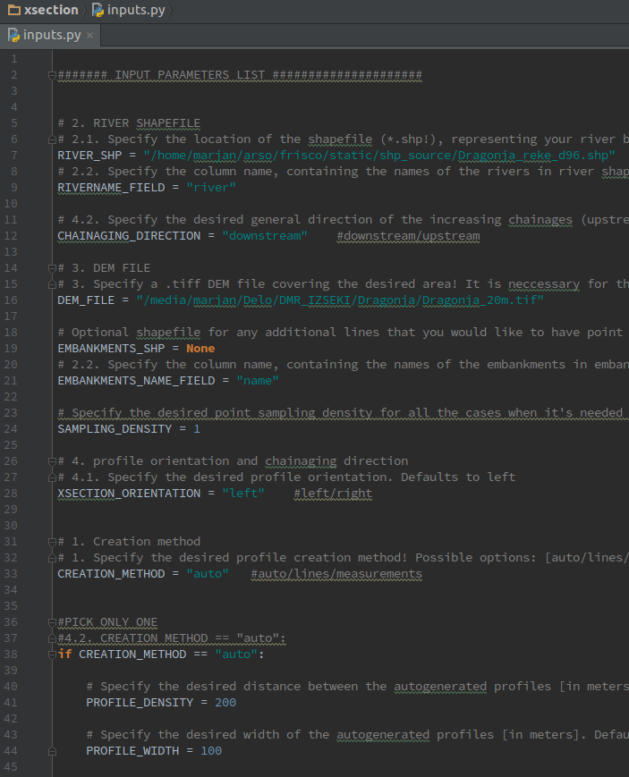

----------------
Running Xsection
----------------

A typical workflow for running Xsection looks like:

1. **Collecting and preparing DEM, rivers and embankments in GIS**
    - Creating a DEM file
    - Collecting or hand-drawing rivers and embankments in their own shapefile
    - Making sure all the spatial data are saved in the same cartesian coordinate system
      (hint: WGS84 is **NOT** a projected coordinate system!)

2. **Collection and preparing cross sectional data in GIS**
    - Converting survey point data into a properly defined shapefile (LINES) or
    - hand-drawing cross section lines in it's own shapefile (MEASUREMENTS) or
    - thinking about the best ``PROFILE_WIDTH`` and ``PROFILE_DENSITY`` settings (AUTO)

2. **Filling out the ``ìnputs.py`` to tell the Xsection about your input data and settings**

   Think of ``inputs.py`` as an fill out form

3. **Running a script**

Once you are happy with the input parameters in ``inputs.py` you are free to run Xsection. Remember to run it
with a correct Python interpreter (= activate virtual environment)

::

    cd *xsection_root_directory*
    activate xsection  #or source activate xsection  on Linux
    python xsection.py

4. **Check for any error messages in terminal or in log.txt**

Xsection will error-check your input parameters and will complain in case of any illogical choices, such as:
    - wrong data types (e.g. not using .tif or .shp format as an input or output file)
    - wrong Shapefile types (e.g. LineString when it should be a Point)
    - non-existing files or shapefile fields
    - ...
