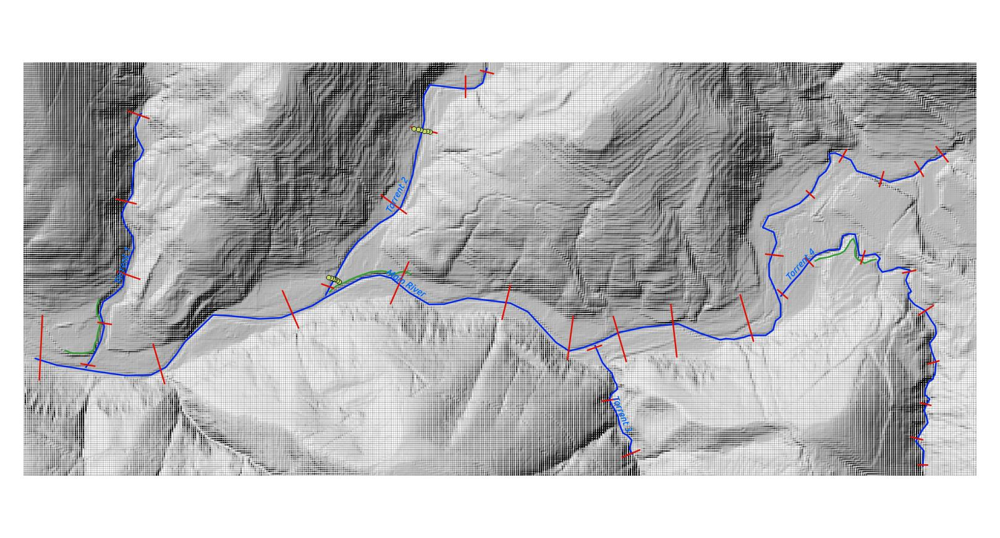

---------------------
Demo with sample data
---------------------

The program ships with a minimal sample data to showcase the basic functionality. In project's root folder, there is a
directory, called *sample_data*. That's where you can find the demo DEM raster, Rivers and Embankments shapefile.

   Demo data overview - DEM raster, Rivers, embankments and profiles of different kinds

``input.py`` settings are already correctly prepared according to the sample data (file paths, shapefile field names,...).
The default ``CREATION_METHOD`` is set to *lines* so, a predefined sample line shapefile, defining the layout of the profiles
will be chosen in profile creation. If you want to demo other creation methods, such a *measurements* or *auto*, you only
have to change the ``CREATION_METHOD`` variable, the rest of the parameteres are already specified according to the sample data.

Once you run the program, the result files will appear in a *sample_data* directory. You can inspect their attributes in GIS software.

