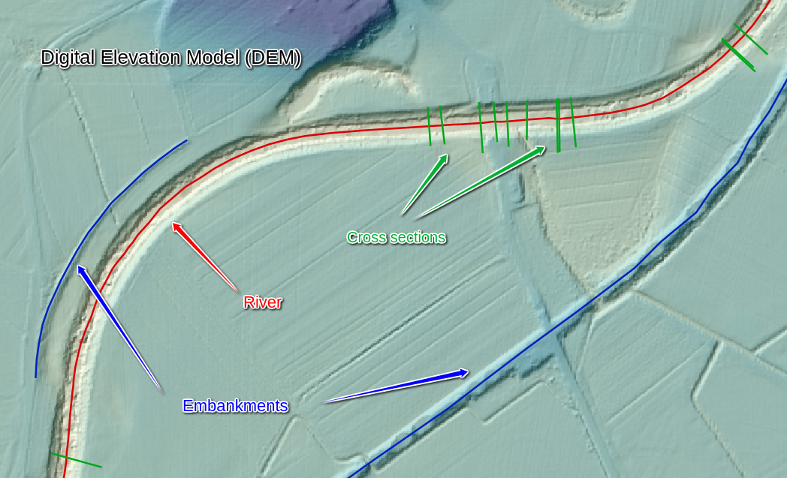

===============================
Xsection functionality overview
===============================

This manual presents using the Xsection script for creation of. At this stage, Xsection in only available as a command
line script, so in order to properly visualize as well as modify the input and output data, it is mandatory to work with
a decent GIS software. I strongly suggest using `QGIS`_ software, since it is very intuitive and open-source.

----------------------
Key concepts and ideas
----------------------

In order to clarify the concepts and the terminology, used in this project, we will start with an overview of the key
elements, that are being used in this project:

Rivers
------

Rivers are imported into a program as a ``Line shapefile``. Program accepts only one river shapefile [RIVER_SHP],
where you can have many rivers as separate LineString features. Every river must have an unique name that is saved
in a shapefile column, called [RIVERNAME_FIELD]. Rivers also have a very important hydraulic-modelling-specific property:
river orientation or [CHAINAGING_DIRECTION]. This can be "upstream" or "downstream". If [CHAINAGING_DIRECTION] is chosen
to "upstream", this means that river "starts" at its lowest lying point and its chainage (or length) is increasing "upstream".
Of course, vice versa for the "downstream". This river property is important for linear referencing applications, especially
for chainaging river cross sections, and is a global setting, set for all rivers in a shapefile at once.

Digital Elevation Model
-----------------------

Digital evelation model (or DEM_FILE) is a **.tif** (!) raster file, covering the extents of the river and desired cross
section locations. It is a mandatory input even if not direct point sampling is desired - it is neccessary for background
setting river orientation (= flipping the order of river points to match the desired linear referencing order).

Embankments [optional]
----------------------

Embankments represents any linear longitudinal objects, normally along the river line, that you would like to have point
sampled from the Terrain. As an input type, they are a similar data source as the [RIVERS_SHP] (ESRI Line shapefiles):
program onlye accepts one embankments file [EMBANKMENTS_SHP], it's attribute table must contain a field, called
[EMBANKMENTS_NAME_FIELD] with unique embankments names. The only difference is that whole embankments thing is completely
optional.

Cross sections
--------------

The most important river geometry feature in 1D river modelling. Cross sections are lines that lie (normally) perpendicular
to the river stream line, where each line consists of many vertices [POINTS], describing the shape of the cross sectional.
One important property of the general cross section setup is [XSECTION_ORIENTATION], which can only be "left" or "right".
This property specifies, how the points in cross section should be ordered. If "left", it means that the first point in
a cross section will lie on a "left" bank of the river, where "left" bank is defined as the bank that is on your left in
a river's downstream local coordinate system. Or put shortly: a left side of the profile is also left side of the river,
if one would look at the river from a boat going downstream.
Another important attributes of a cross section profiles are of course it linear referencing attributes:
- A river that it belongs to
- a chainage at which it is placed onto.

.. note:: Each profile section must have one (and only one!) crossing point with one (and only one river!). That is the
         only way to ensure a proper profile attributes (river, chainaging and orientation)!

Sampling density
----------------

This is a general project-wise setting, that specifies the distance between consecutive points in any program-generated
point sampling operation and therefore the "resolution" of the point-sampled output elements. It defaults to 1m,
however, if less detailed profile/embankment/riverline is needed, you can set this number to your liking... However,
mind that this setting should be consistent with the resolution of the used Digital Evelation model.

.. warning:: All the math inside Xsection works in a cartesian coordinate system. Neither does Xsection perform any
            reprojections or transformations of the input spatial data. Therefore is absolutely neccessary
            for user to make sure that all data inputs (shapefiles, rasters,...) are in the **identical projected coordinate system!**.
            Use QGIS or any other GIS tool to perform any reprojections of the input data with different spatial reference!

------------------------------
Cross section creation methods
------------------------------

While specifying the input parameters for cross sections, user will be asked to choose the desired [CREATION_METHOD].
There are 3 different profile creation options (or methods) to choose from:
   - "auto" (automatic generation based on generic parameters - sampling DEM)
   - "lines" (generation based line shapefile, containting predefined cross section locations - sampling DEM)
   - "measurements" (parsing the shapefile, containg the geodetic surveying points - no DEM sampling)

Each creation method requires a different set of input parameters. Below we discuss each possible option:

Creation method: AUTO
---------------------

This is the simplest available profile creation method, as it doesn't require any existing point measurements or
hand-drawn cross section lines as an input. Profile locations are generated automatically along the river lines according
to the specified creation parameters:

- ** Profile density **
   A parameter, defining the distance between the autogenerated profiles. Defaults to 200 meters.

- ** Profile width **
   A parameters, defining the desired width of a cross section profile. Profile will stretch half this distance on each
   side of the river center-line.

All profiles are generated perpendicular to the river line, starting almost at the beggining of the river, ending almost
at the end of the river and with an evenly spaced linear distance from each other.

.. warning:: Mind that a cost for such a simplicity is (besides poorly defined river geometry) a very probable breaking
of the "only one river at one point" rule, especially with very dense placement on wide profiles on a very curvy river
stream lines. All cross sections with ambiguous chainage definition get assigned a chainage 0.

Creation method: LINES
----------------------

This creation options requires an existing Line shapefile which previously (possibly manually) generated cross section
locations. This option gives you more freedom and accuracy in catching the hydraulic situation of the terrain, compared
to "auto" cration method. You can use QGIS to carefully place every single cross section at the exact location that you
find important for the performance of your model, as well enables you to avoid cris-crossing of the profiles.

.. figure:: img/auto_creation_overview.png
   :align: center

Creation method: MEASUREMENTS
-----------------------------

This creation options a bit specific as it is the only one that doesn't include gathering elevation data from DEM.
It is actually more of a parser of the geodetic survey points, passed to a program in a form of a point shapefile
[XSECTION_SHP]. Therefore the shapefile requires quite a rigid structure to ensure points get parsed correctly.
Let's see the required parameters:

- ** xsection_profile_id_field **
   A shapefile field, containing a name of the profile that certain point belongs to.

- ** xsection_point_id_field **
   A shapefile field, contaning a consecutive number (order) of the certain point within a profile.

- ** z_field **
   A shapefile field, containg an evelation (height) value of the certain point

------------
Result files
------------

One a program is run, it can output results in several different ways/format.

- ** XNS11_OUT_TXT **
   This is a main script output. A text file contains all the neccesary cross section geometry data in a format, that
   can easily be imported into a *.xns11* cross section geometry file. It defaults to "Mike11_xns_ready.txt".

- ** RIVER_POINT_OUT_SHP **
   An optional point shapefile, containing point vertices from the input river shapefile with point sampled values from
   the specified DEM file.

- ** EMBANKMENTS_POINT_OUT_SHP **
   The same as the [RIVER_POINT_OUT_SHP], but for the embankments input shapefile.

- ** XSECTION_POINTS_OUT_SHP **
   An optional point shapefile, containg all the data that were used in XNS11_OUT_TXT result file generation

- ** XSECTION_LINE_OUT_SHP **
   The Line shapefile version of the [XSECTION_POINTS_OUT_SHP].

.. _QGIS: http://www.qgis.org/en/site/forusers/download.html